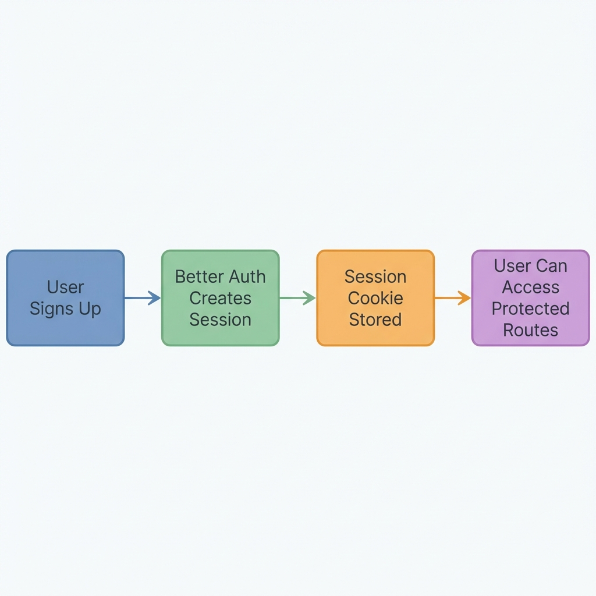
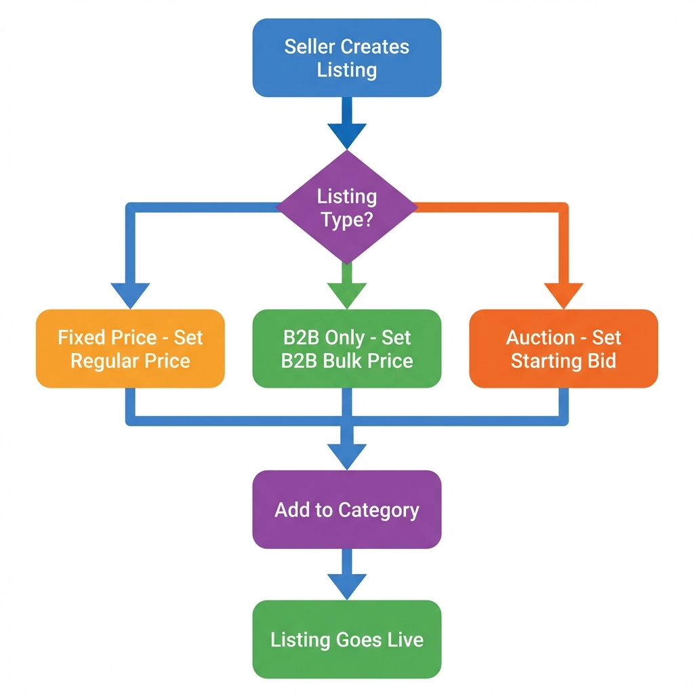
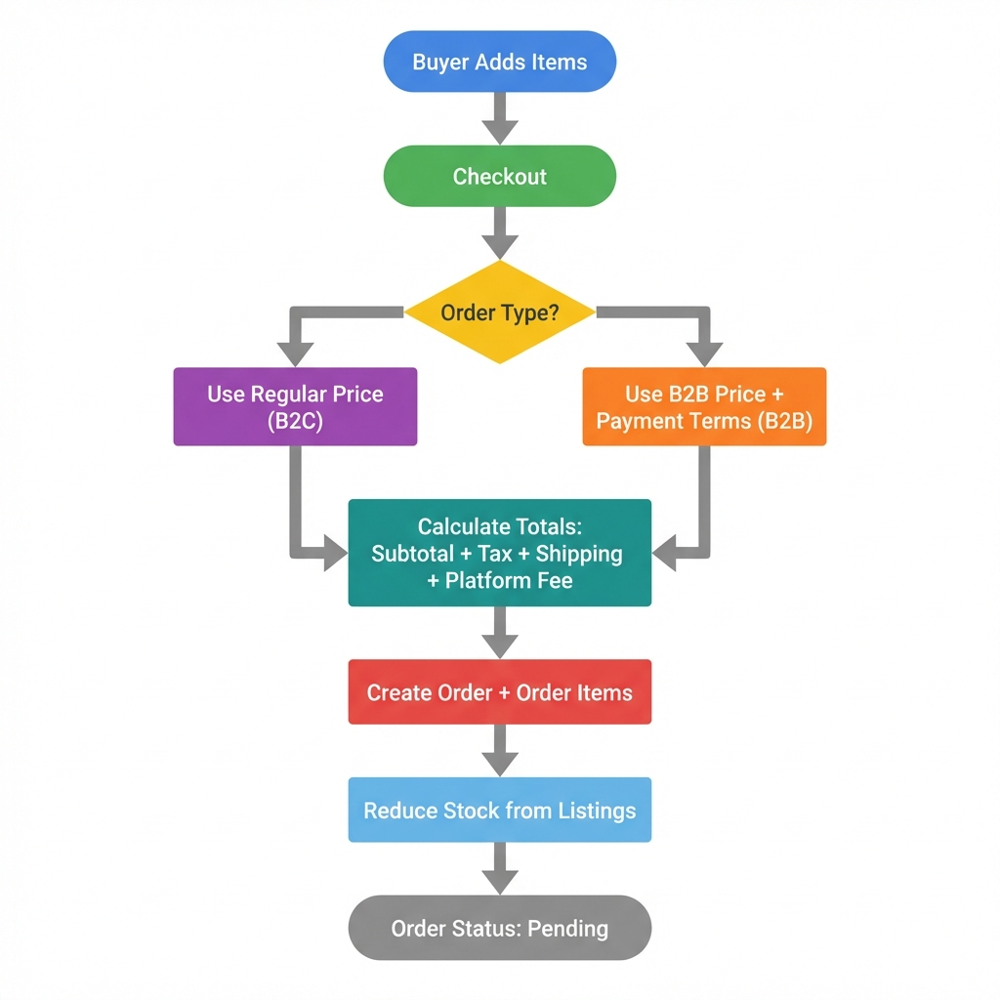
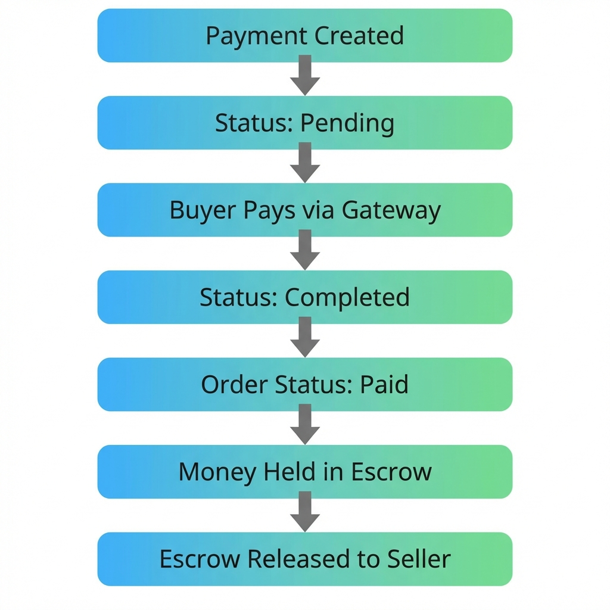
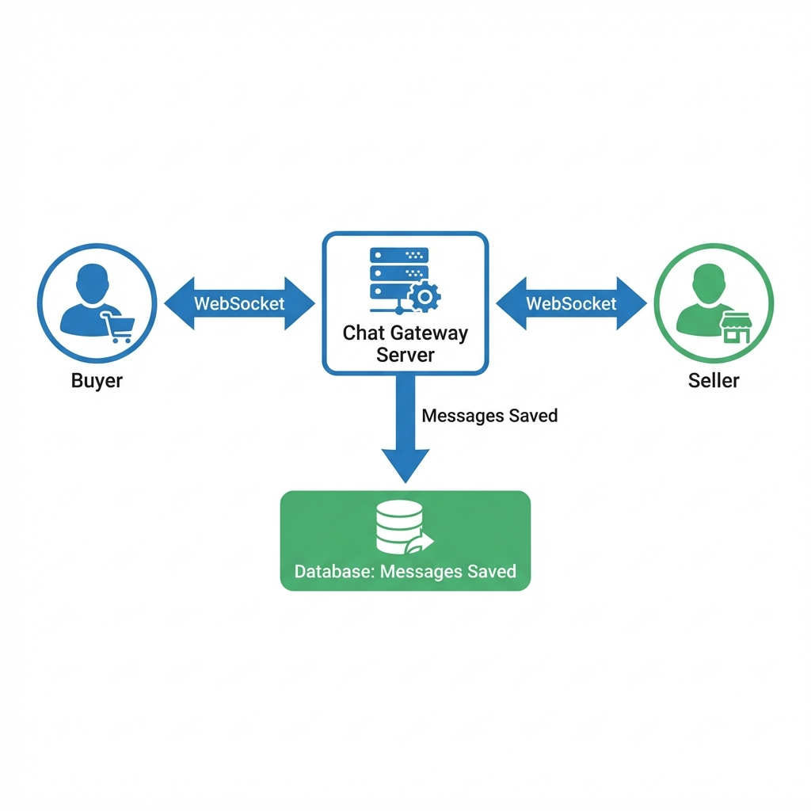

# Nizron Marketplace - Backend Explained

> A simple guide explaining how the **Nizron Marketplace** backend works, written in plain English.

---

## 1. What is This App?

**Nizron Marketplace** is an **E-Commerce platform** that supports both:
- **B2C** (Business-to-Consumer): Regular people buying products
- **B2B** (Business-to-Business): Companies buying from other companies in bulk

Think of it as a combination of Amazon (for regular shoppers) and Alibaba (for wholesale buyers).

---

## 2. Technology Stack (What Tools Are We Using?)

| Technology | Purpose | Why We Use It |
|------------|---------|---------------|
| **NestJS** | Backend Framework | Organizes code into modules, makes it easier to build & maintain |
| **Express** | HTTP Server | Handles incoming web requests (REST API) |
| **TypeScript** | Programming Language | JavaScript with types = fewer bugs |
| **SQLite** | Database | Simple, file-based database (easy to set up) |
| **Drizzle ORM** | Database Layer | Write database queries using TypeScript (type-safe) |
| **Better Auth** | Authentication | Handles login/signup with sessions & cookies |
| **Socket.io** | Real-time Communication | Powers the buyer-seller chat feature |
| **Swagger** | API Documentation | Auto-generates interactive API docs at `/api` |

---

## 3. How is the Code Organized?

```
src/
├── main.ts              # App entry point - starts everything
├── app.module.ts        # Main module - imports all other modules
├── lib/
│   └── auth.ts          # Authentication configuration
├── database/
│   └── database.module.ts  # Database connection setup
├── db/
│   └── schema/          # 20 database table definitions
└── modules/             # 10 feature modules
    ├── users/           # User management
    ├── companies/       # B2B company profiles
    ├── categories/      # Product categories
    ├── listings/        # Product listings (items for sale)
    ├── orders/          # Order management
    ├── payments/        # Payment processing
    ├── shipping/        # Shipping & delivery
    ├── disputes/        # Buyer-seller disputes
    ├── reviews/         # Product reviews & ratings
    └── chat/            # Real-time buyer-seller messaging
```

Each module follows this pattern:
```
module-name/
├── module-name.module.ts      # Registers module with NestJS
├── module-name.controller.ts  # API endpoints (routes)
├── module-name.service.ts     # Business logic
├── module-name.repository.ts  # Database operations
└── dto/                       # Data validation rules
```

---

## 4. The Main Business Flow

### 4.1 User Registration & Authentication



- Users can be **Buyers**, **Sellers**, or **Admins**
- Users can be **Individual** (B2C) or **Business** (B2B)
- Business users link to a **Company** profile

### 4.2 Product Listing Flow (Sellers)



**Listing Features:**
| Feature | Description |
|---------|-------------|
| Dual Pricing | Different prices for B2C vs B2B customers |
| Stock Management | Tracks inventory, prevents overselling |
| Categories | Organized product taxonomy |
| View Counter | Tracks product popularity |

### 4.3 Order Placement Flow (Buyers)



**Order Calculation:**
```
Subtotal = Sum of (item price × quantity)
Tax = 10% of Subtotal
Platform Fee = 5% of Subtotal
Shipping = Fixed $10
Total = Subtotal + Tax + Shipping
```

### 4.4 Payment Flow



**Payment Terms (B2B):**
- **Immediate**: Pay now
- **Net15**: Pay within 15 days
- **Net30**: Pay within 30 days
- **Net60**: Pay within 60 days

### 4.5 Real-Time Chat Flow



**Chat Features:**
| Feature | How It Works |
|---------|--------------|
| Real-time Messages | WebSocket connection, instant delivery |
| Typing Indicators | Shows "User is typing..." |
| Read Receipts | Marks messages as read |
| Multi-device Support | Same user on multiple tabs gets synced |

---

## 5. Database Tables (20 Total)

### Core Tables

| Table | Purpose |
|-------|---------|
| `users` | All users (buyers, sellers, admins) |
| `sessions` | Login sessions (managed by Better Auth) |
| `accounts` | OAuth accounts (if using social login) |
| `verifications` | Email verification tokens |

### B2B Tables

| Table | Purpose |
|-------|---------|
| `companies` | Business profiles with tax ID, credit limits |

### Product Tables

| Table | Purpose |
|-------|---------|
| `categories` | Product categories (Electronics, Clothing, etc.) |
| `listings` | Products for sale |
| `auctions` | Auction listings data |
| `bids` | Bids placed on auctions |

### Order & Payment Tables

| Table | Purpose |
|-------|---------|
| `orders` | Customer orders |
| `order_items` | Individual items in each order |
| `payments` | Payment records with escrow status |
| `payouts` | Money paid out to sellers |
| `revenue` | Platform revenue tracking |

### Post-Order Tables

| Table | Purpose |
|-------|---------|
| `shipping` | Shipping tracking info |
| `disputes` | Buyer-seller disputes |
| `reviews` | Product reviews & ratings |

### Chat Tables

| Table | Purpose |
|-------|---------|
| `conversations` | Chat threads between buyer & seller |
| `messages` | Individual chat messages |

---

## 6. API Endpoints Overview

All endpoints are prefixed with `/api/v1`

| Module | Endpoints | Description |
|--------|-----------|-------------|
| Auth | `/api/v1/auth/*` | Login, signup, logout (via Better Auth) |
| Users | `/api/v1/users` | CRUD for user profiles |
| Companies | `/api/v1/companies` | B2B company management |
| Categories | `/api/v1/categories` | Product category CRUD |
| Listings | `/api/v1/listings` | Create/search/update products |
| Orders | `/api/v1/orders` | Place & manage orders |
| Payments | `/api/v1/payments` | Payment processing |
| Shipping | `/api/v1/shipping` | Shipment tracking |
| Disputes | `/api/v1/disputes` | Raise & resolve disputes |
| Reviews | `/api/v1/reviews` | Product reviews |
| Chat | `/api/v1/chat` | REST endpoints + WebSocket at `/chat` |

> 📖 **Interactive API Docs**: Visit `http://localhost:3000/api` for Swagger UI

---

## 7. Authentication & Security

### How Login Works

1. User submits email + password to `/api/v1/auth/sign-in/email`
2. Better Auth validates credentials
3. Session created & stored in database
4. Session cookie (`better-auth.session_token`) sent to browser
5. All future requests include this cookie automatically

### Security Features

| Feature | Implementation |
|---------|----------------|
| Password Hashing | SHA-256 (in Users module) |
| Session Management | Database-stored sessions, 7-day expiry |
| Input Validation | Class-validator with DTOs |
| CORS | Enabled for frontend origins |

---

## 8. How Each Module Works

### Users Module

```typescript
// What it does:
- Create user account
- Find user by ID or email  
- Update profile
- Soft-delete (mark inactive, don't delete)
```

### Listings Module

```typescript
// What it does:
- Create product listing with price, stock, category
- Search listings by query
- Filter by seller or category
- Track view counts
- Update stock when ordered
```

### Orders Module

```typescript
// What it does:
- Calculate order totals (items + tax + shipping + fees)
- Create order with multiple items from different sellers
- Automatically reduce stock from listings
- Track order status: Pending → Paid → Processing → Shipped → Delivered
```

### Payments Module

```typescript
// What it does:
- Create payment linked to order
- Update payment status (Pending → Completed)
- Escrow management (Hold → Released or Refunded)
- Triggers order status updates
```

### Chat Module

```typescript
// Real-time WebSocket events:
- 'join': User connects to their room
- 'sendMessage': Send a message
- 'typing': Typing indicator
- 'markRead': Mark messages as read

// REST endpoints for:
- Get conversation history
- Get all user's conversations
- Create new conversation
```

---

## 9. Summary

**Nizron Marketplace** is a full-featured e-commerce backend that:

1. **Supports both B2C and B2B** - Regular buyers and wholesale businesses
2. **Handles the full purchase cycle** - From listing to order to payment to delivery
3. **Provides real-time chat** - Buyers can message sellers instantly
4. **Includes dispute resolution** - Handle problems between buyers and sellers
5. **Tracks revenue** - Platform fees and seller payouts

### Quick Reference

| What You Want | Where To Look |
|---------------|---------------|
| Start the app | `npm run start:dev` |
| API Documentation | `http://localhost:3000/api` |
| Database | `./data/database.sqlite` |
| Add a new feature | Create a new module in `src/modules/` |
| Modify table schema | Edit files in `src/db/schema/` |

---

*Generated on January 14, 2026*
